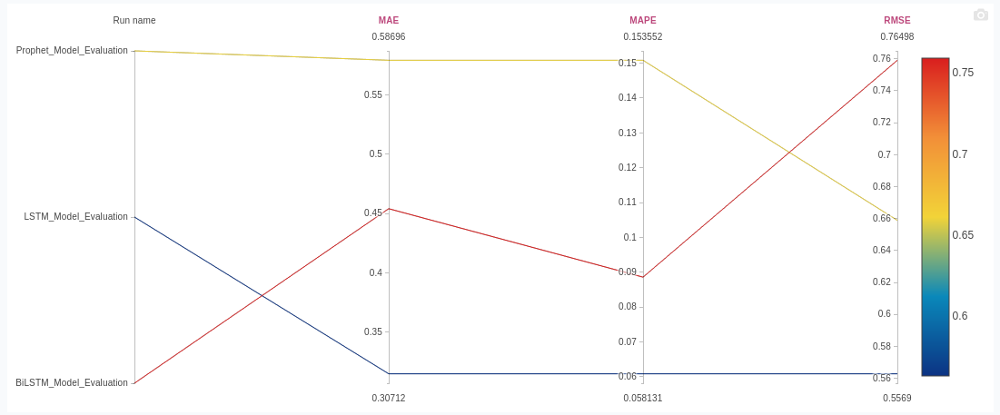
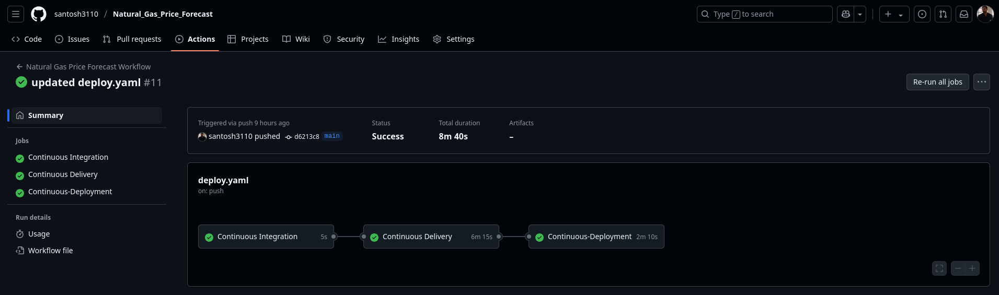

# 🔮 Natural Gas Price Forecasting App

  
A full-stack ML-based forecasting web app that predicts Natural Gas Prices using advanced time series models like LSTM, BiLSTM, Prophet, and GARCH. Powered by Flask, Docker, GitHub Actions, and deployed to AWS EC2 with full CI/CD and MLOps tooling.

---

## 🧠 Key Features

- 📥 **Data Ingestion** 
  - Historical price data from Yahoo Finance
  - Utility Gas weighted Heating Degree Days(HDD) data from NOAA(National Oceanic and Atmospheric Administration)
  - Lower 48 states Natural Gas Underground Storeage data from EIA (Energy Information Admin)
- 🧹 **Data Preparation** with feature engineering: Returns, Volatility, Inventory
- 🔍 **Technical Indicator**: GunSan Technical Strength + Signal line from gunsan strength index(GSI)
- 📈 **Models Used**:
  - Facebook Prophet (baseline)
  - LSTM & BiLSTM (deep learning)
  - GARCH(1,1) (volatility)
- 🔧 **Feature Engineering for Forecasting**
  - Simulates future inventory, HDD, volume using Prophet
  - Forecasts volatility using GARCH(1,1)
  - Rolling signal, MA, cumulative features
- 🧪 **Model Evaluation**
  - Metrics: MAE, RMSE, MAPE
  - Plots for all models
  - Logged to MLflow, tracked via DAGsHub MLflow Server
- 🌐 **Flask Web App** to visualize GunSan Strength, GARCH Forecast and Price Forecast with LSTM and BiLSTM models with a toggle
- 🐳 **Dockerized** Production-ready Dockerfile
- 🚀 **CI/CD Deployment** with GitHub Actions + ECR + EC2
- 📦 **DVC Tracked Pipeline** 
  - Each pipeline stage tracked with dvc.yaml
  - Model checkpoints, artifacts version-controlled

---

## 📁 Project Structure

```
Natural_Gas_Price_Forecast/
│
├── app.py                            # Flask web app entry point
├── main.py                           # Pipeline orchestrator (via DVC)
├── Dockerfile                        # Docker setup for app
├── requirements.txt                  # Python dependencies
├── setup.py                          # Package setup
├── params.yaml                       # Model & pipeline hyperparameters
├── dvc.yaml                          # DVC pipeline stages
├── dvc.lock                          # DVC lock file
├── README.md                         # 📘 Project documentation
│
├── config/
│   └── config.yaml                   # YAML config for stages
│
├── artifacts/                        # ⛏️ All artifacts organized by pipeline stage
│   ├── data_ingestion/              # Raw CSVs from Yahoo & EIA
│   ├── prepare_data/                # Processed final dataset
│   ├── prophet_baseline/            # Prophet model, plots & metrics
│   ├── lstm_model/                  # Trained LSTM + scalers
│   ├── bilstm_model/                # Trained BiLSTM + scalers
│   ├── forecast_with_lstm/          # LSTM forecast & plot
│   ├── forecast_with_bilstm/        # BiLSTM forecast & plot
│   ├── model_evaluation/            # Comparison plots + JSON report
│   └── future_feature_engineering/  # Prophet + GARCH forecasted features
│
├── logs/                             # 🔍 Log files per pipeline step
│
├── research/                         # 📓 Jupyter experiments
│   ├── baseline_experiment.ipynb
│   ├── lstm_experiment.ipynb
│   └── bilstm_experiment.ipynb
│
├── src/                              # 🧠 Core package: gaspriceforecast
│   └── gaspriceforecast/
│       ├── components/              # Individual pipeline stage logic
│       ├── config/                  # Config manager
│       ├── constants/               # Constants used globally
│       ├── entity/                  # Config entity schemas
│       ├── pipeline/                # All pipeline stage runners
│       └── utils/                   # Helper functions (logger, common utils)
│
├── templates/                        # 🖼 HTML for Flask pages
│   ├── index.html
│   ├── page1.html
│   ├── page2.html
│   └── page3.html
│
├── static/                           # 🖼 Static files (CSS, Images)
│   ├── bg.webp
│   └── style.css
│
└── dist/                             # Distribution builds

```

---

## ⚙️ Pipeline Stages (via DVC + MLflow + GitHub Actions)

### 🛰️ Stage 0: Data Ingestion
- 📈 Natural Gas price data from Yahoo Finance
- 🏭 EIA: Lower 48 States Natural Gas Underground Storage (Bcf)
- ❄️ NOAA: Heating Degree Days (HDD)
✅ Saved as artifacts/data_ingestion/*.csv

### 🧹 Stage 1: Data Preparation
- ✅ Clean + merge datasets
- ✅ Feature Engineering:
  - 🔁 Returns
  - 📊 Historical Volatility
  - 📉 GunSan Technical Strength
  - 🔂 Lags, Moving Averages (MA), and Cumulative Sums
✅ Output: artifacts/prepare_data/processed_data.csv

### 📈 Stage 2: Prophet Baseline
- ✅ Forecast on Close prices
- ✅ Multiplicative mode + yearly, weekly, and monthly seasonality (custom Fourier)
✅ Output:
  - Forecast CSV + Prophet components plot saved in artifacts
  - Metrics logged via mlflow_model_evaluation.py to Dagshub MLflow server

### ✅ Stage 3–4: LSTM & BiLSTM Model
- 🧠 Deep learning with past 60-day lookback window
- 🔢 Feature scaling and reshaping using StandardScaler
- 🔮 LSTM and BiLSTM architecture built in Keras
✅ Output:
  - lstm_model.h5 and bilstm_model.h5 along with their respective scalers and plots saved to artifacts

### 📊 Stage 5: Model Evaluation
- ✅ Evaluation on test set using
  - MAE, RMSE, MAPE
- ✅ Results visualized in comparison plot
- 📉 model comparision plot and evaluation_report saved to artifacts
- 📈 Metrics and plots logged to MLflow, tracked via DAGsHub : https://dagshub.com/santoshkumarguntupalli/Natural_Gas_Price_Forecast.mlflow

- Parallel Coordinate Plot:
  

### 🔧 Stage 6: Future Feature Engineering
- 📅 Prophet-based simulation for features (Volume, HDD, Inventory_Bcf)
- 📊 GARCH(1,1) for volatility
- 🧠 Signal Recalculation with simulated data
✅ Output: last_known.csv, future_features.csv and interactive GARCH Plot saved to artifacts

### 🔮 Stage 7–8: Forecasting with LSTM & BiLSTM
- ✅ Predict future gas prices using trained models
- ✅ Toggle forecast view in Flask app
- ✅ Final output: Saved to Artifacts
  - forecast_with_lstm/forecasted_prices.csv
  - forecast_with_bilstm/forecasted_prices.csv
  - Visual plots for both models

- All pipeline stages are:

  - 🔁 Reproducible using dvc repro
  - 🧪 Evaluated via MLflow on DAGsHub
  - 📦 Versioned using DVC for data and models
  - ✅ Deployed using CI/CD via GitHub Actions to AWS EC2 (Docker + ECR)

---

## 💻 Flask App Pages

| Page            | Description                          |
|-----------------|--------------------------------------|
| `/`             | Homepage with navigation             |
| `/page1`        | GunSan Technical Strength plot       |
| `/page2`        | GARCH Volatility Forecast (Plotly)   |
| `/page3`        | LSTM/BiLSTM Price Forecast plots     |
| `/download`     | CSV download of forecast data        |
| `/api/forecast` | JSON API for model outputs           |

---

## 🐳 Dockerfile Summary

```dockerfile
FROM python:3.11-slim
WORKDIR /app
COPY requirements.txt .
RUN pip install --no-cache-dir -r requirements.txt
COPY . .
EXPOSE 5000
CMD ["gunicorn", "--bind", "0.0.0.0:5000", "app:app"]
```

---

## 🔁 CI/CD Workflow

### ✅ GitHub Actions → AWS ECR → EC2

- **Trigger**: Push to `main` branch
- **Jobs**:
  1. CI (Lint + Test placeholder)
  2. CD:
     - Build image
     - Push to ECR
     - SSH to EC2 & redeploy container
---

## 🚀 Deployment Options

### 🔸 EC2 + Docker + GitHub Actions

- Set up `self-hosted runner` on EC2
- Define `deploy.yaml` with Docker build/push/run
- Port 5000 mapped to 80 (or 8080)

CI/CD deployment to EC2 through GitHub Actions:


### Alternate Deploy on Render.com

- App was deployed on Render through GitHub Auto Deploy
- Access to the App: https://natural-gas-price-forecast.onrender.com

---

## 📊 Forecast Sample of Output

| Date       | Model  | Forecasted Close |
|------------|--------|------------------|
| 2025-06-06 | LSTM   | 3.6024952        |
| 2025-06-06 | BiLSTM | 3.4271307        |

---

## 🔐 Secrets/Configs

| Key                    | Where                  |
|------------------------|------------------------|
| `AWS_ACCESS_KEY_ID`    | GitHub → Secrets       |
| `AWS_SECRET_ACCESS_KEY`| GitHub → Secrets       |
| `AWS_REGION`           | GitHub → Secrets       |
| `ECR_REPOSITORY_NAME`  | GitHub → Secrets       |
| `AWS_ECR_LOGIN_URI`    | GitHub → Secrets       |

---

## 📷 Screenshots

> _App screenshots on Ec2 Instance_


---

## 🤝 Credits

- **Data Sources**: [Yahoo Finance](https://finance.yahoo.com/), [EIA.gov](https://www.eia.gov/), [NOAA.gov](https://www.noaa.gov/)
- **ML Models**: Prophet, LSTM, BiLSTM, GARCH
- **Hosting**: AWS EC2 via Docker, Render

---

## 👨‍💻 Author

**Santosh Guntupalli**  
_“Built with 🔥 and deployed with 💪”_

---

## 🧭 Future Improvements

### 🔧 Core Pipeline Enhancements

  - ✅ Add SQLite Backend
    Store forecasts and user queries locally using SQLite for persistent storage and retrieval.

  - ⏳ Real-Time Data Integration
    Integrate live data from APIs like Alpha Vantage, EIA, or NOAA to keep predictions up to date.

  - 📈 Forecast Uncertainty Bounds
    Add confidence intervals or prediction bands for all models (e.g., Prophet, LSTM).

  - 📦 Export to AWS S3
    Automatically store forecasts, logs, and artifacts in S3 for cloud-based versioning and backup.

  - ☁️ Scalable Deployment Options
    Shift to ECS/Fargate or platforms like Render.com for auto-scaling and better production readiness.

### 🔍 Current Data Used

  - 📉 Historical OHLC price data (Yahoo Finance)

  - 🏭 Lower 48 States Natural Gas Underground Storage (EIA)

  - ❄️ Utility Gas Weighted Heating Degree Days (NOAA)

  - 🧠 Feature Engineering: Returns, Volatility, GunSan Strength, Moving Averages

### 🚀 Suggested Additional Features

 To enhance prediction accuracy and better reflect market behavior:

  - 💰 Natural Gas Futures & Options Data
    Use futures curves, open interest, and volatility (from CME/ICE) for market sentiment.

  - 🌡️ Cooling Degree Days (CDD)
    Include CDD to capture gas demand for summer cooling.

  - 🔌 Electricity Generation Mix
    Track gas consumption in power plants (via EIA 860/923 datasets).

  - 🛢️ Crude Oil Price Trends
    WTI and Brent oil prices often correlate with gas prices.

  - 🌍 LNG Export/Import Volumes
    Include global LNG trade data to factor in international demand-supply effects.

  - 🧾 Storage Injection/Withdrawal Rates
    Model weekly changes in storage, not just current storage level.

  - 📊 7–14 Day Weather Forecasts
    Integrate ensemble forecasts (e.g., GFS, ECMWF) to anticipate demand swings ahead of time.

---

> ⭐ **Leave a star** if you like this project!
